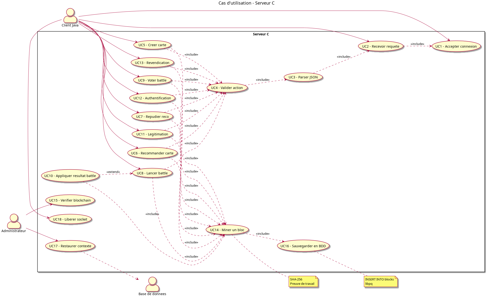
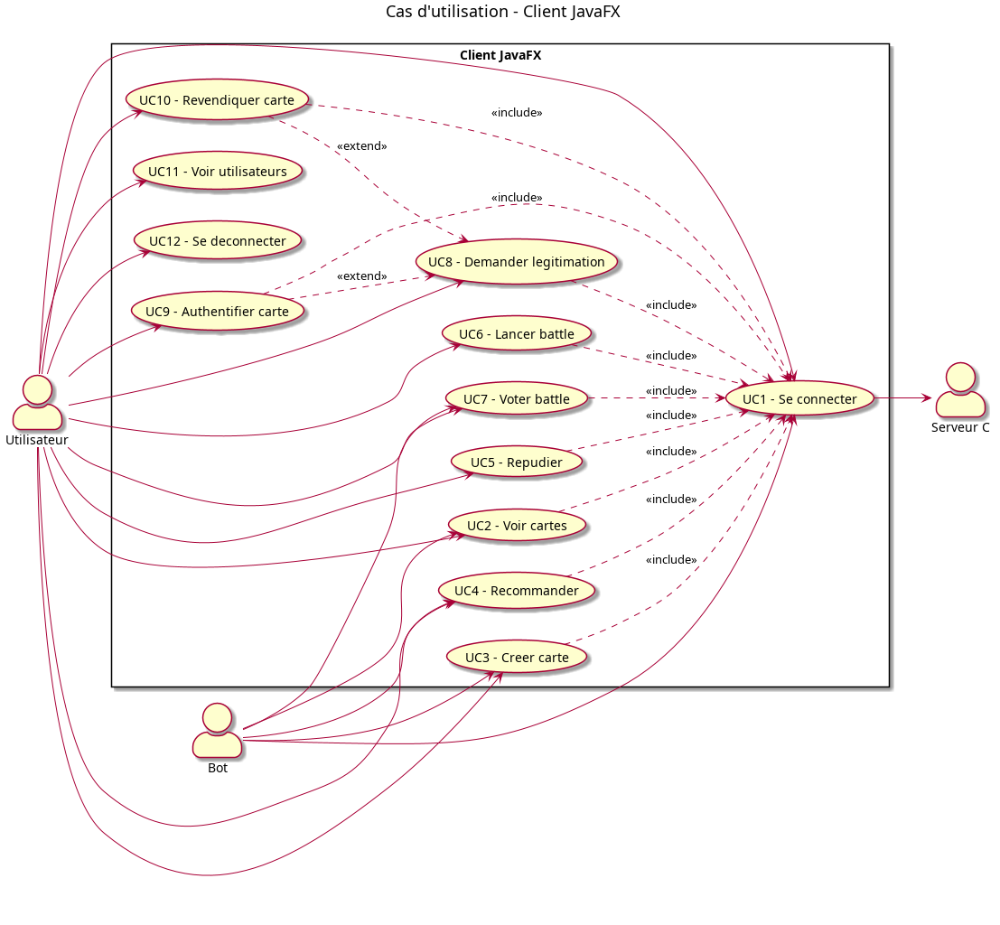

# Annexe B — Cas d'utilisation

> Diagrammes de cas d'utilisation de la plateforme.

## 1. Cas d'utilisation global

## 2. Acteurs

| Acteur | Description |
|---|---|
| **Utilisateur** | Personne humaine utilisant un client JavaFX. |
| **Bot** | Client automatique (optionnel) pour les tests et démonstrations. |
| **Serveur** | Processus C unique, multitâche, qui valide les actions. |
| **Base de données** | PostgreSQL, accessible uniquement par le serveur. |

## 3. Cas d'utilisation principaux

- Démarrer la plateforme
- Se connecter / se déconnecter
- Créer une carte (langage)
- Recommander une carte
- Répudier une recommandation
- Lancer une battle
- Voter dans une battle
- Demander une légitimation
- Revendiquer une carte
- Authentifier une carte
- Vérifier la cohérence de la blockchain
- Arrêter proprement le serveur

## 4. Cas d'utilisation côté serveur

## 5. Cas d'utilisation côté client

