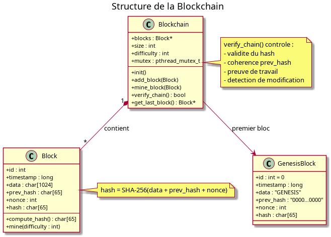

# Annexe C — Diagrammes de classes

> Diagrammes de classes du serveur C et du client Java.

## 1. Diagramme de classes — Serveur C

### Structures principales

- `Block` — Bloc de la blockchain
- `Blockchain` — Liste chaînée de blocs
- `Carte` — Carte langage
- `Utilisateur` — Utilisateur connecté
- `Recommandation` — Recommandation
- `Battle` — Battle
- `Vote` — Vote
- `ActionCarte` — Légitimation / revendication / authentification

## 2. Diagramme de classes — Client JavaFX

### Classes principales

- `Card` — Modèle carte langage
- `User` — Modèle utilisateur
- `Battle` — Modèle battle
- `Vote` — Modèle vote
- `Request` — Requête JSON
- `Response` — Réponse JSON
- `NetworkClient` — Communication socket

## 3. Diagramme de classes — Blockchain

## 4. Correspondance avec le cahier des charges

- Une carte possède un identifiant unique, un propriétaire, un créateur, un statut.
- Une recommandation contribue à la VA.
- Une battle confronte deux cartes actives du même paradigme.
- La carte gagnante récupère 50 % des recos de la perdante.
