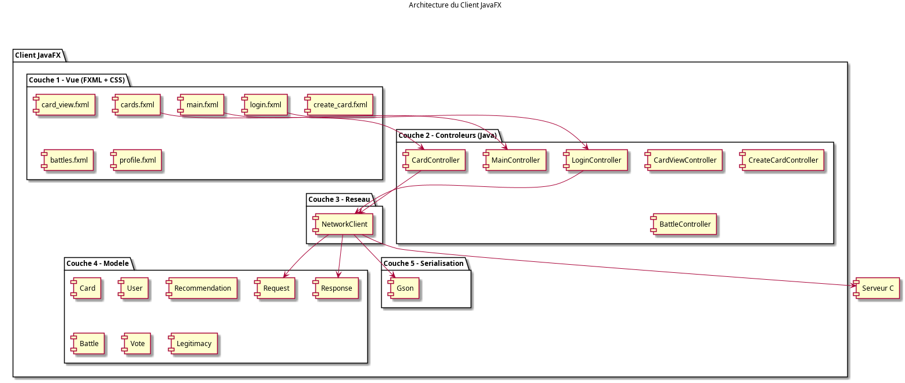
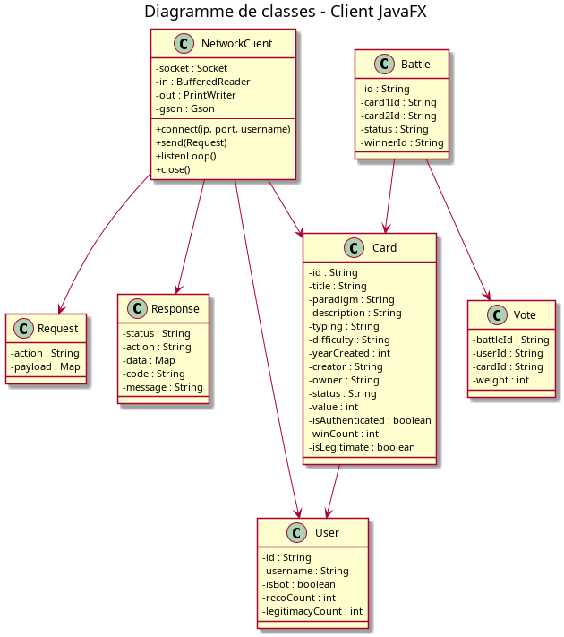
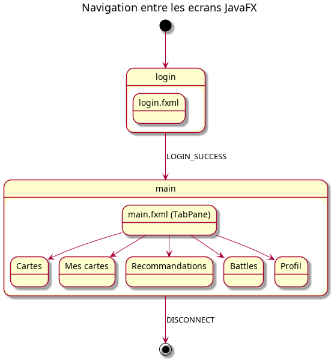

# Architecture du client

> Client Java / JavaFX de la plateforme SAE-Recommender.

## 1. Vue d'ensemble

Le client est une application JavaFX qui communique avec le serveur C par sockets TCP.

## 2. Architecture en 5 couches

Le client est organisé en cinq couches distinctes.

### 2.1 Couche 1 — Vue (JavaFX / FXML / CSS)

**Rôle :** Afficher les écrans et capturer les actions de l'utilisateur.

**Contrainte :** Aucune logique métier.

**Composants :**
- `login.fxml` — Écran de connexion
- `main.fxml` — Fenêtre principale
- `cards.fxml` — Onglet cartes
- `create_card.fxml` — Dialogue de création
- `battles.fxml` — Onglet battles
- `profile.fxml` — Profil utilisateur

### 2.2 Couche 2 — Contrôleurs (Java / JavaFX)

**Rôle :** Lire les champs, appeler `NetworkClient`, mettre à jour l'UI.

**Contrainte :** Utiliser `Platform.runLater()` pour les mises à jour UI.

**Composants :**
- `LoginController`
- `MainController`
- `CardController`
- `CreateCardController`
- `BattleController`
- `ProfileController`
- `RecommendationController`

### 2.3 Couche 3 — Réseau (java.net.Socket)

**Rôle :** Ouvrir la socket, envoyer les requêtes, écouter les réponses.

**Contrainte :** Thread séparé pour `listenLoop()`.

**Composants :**
- `NetworkClient` — Gestion de la socket
- `Protocol` — Sérialisation JSON (Gson)
- `MessageDispatcher` — Distribution des messages
- `NetworkListener` — Interface de callback

### 2.4 Couche 4 — Modèle (POJO Java)

**Rôle :** Représenter les données côté client.

**Contrainte :** Sérialisables en JSON.

**Composants :**
- `Card`, `User`, `Battle`, `Vote`, `Recommendation`, `Legitimacy`, `Notification`

### 2.5 Couche 5 — Sérialisation (Gson)

**Rôle :** Convertir objet Java ↔ JSON.

**Contrainte :** Noms de champs identiques entre Java et JSON.

## 3. Diagramme de classes

## 4. Navigation JavaFX

## 5. Flux de données

### Exemple : créer une carte

1. L'utilisateur clique sur « Créer »
2. `CreateCardController` récupère et valide les champs
3. `CardService` formate la requête JSON
4. `NetworkClient.send()` envoie sur la socket
5. Le serveur traite et répond
6. `MessageDispatcher` notifie les listeners
7. `Platform.runLater()` met à jour l'IHM

## 6. Contraintes de qualité

- Aucune méthode Java ne dépasse 200 lignes
- Commentaires en anglais
- En-tête de documentation pour chaque méthode
- Tests JUnit pour les services et le protocole

## 7. Ce que le client ne fait PAS

- Aucun accès direct à la BDD
- Aucun stockage permanent
- Aucune source de vérité (le serveur est seul maître)
