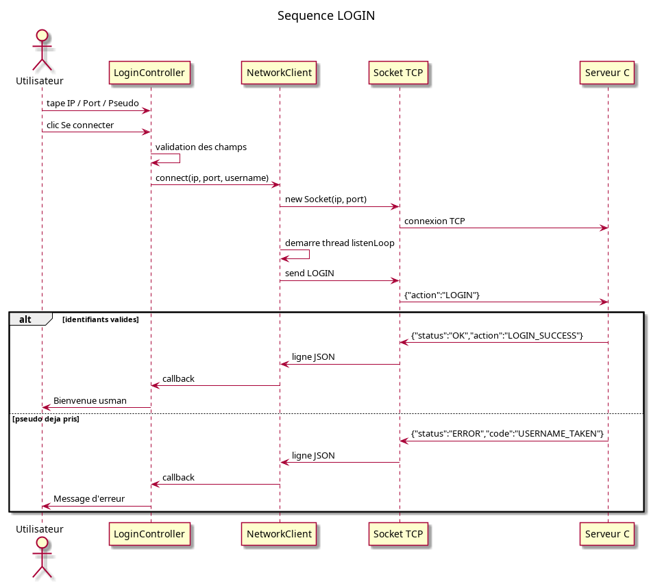
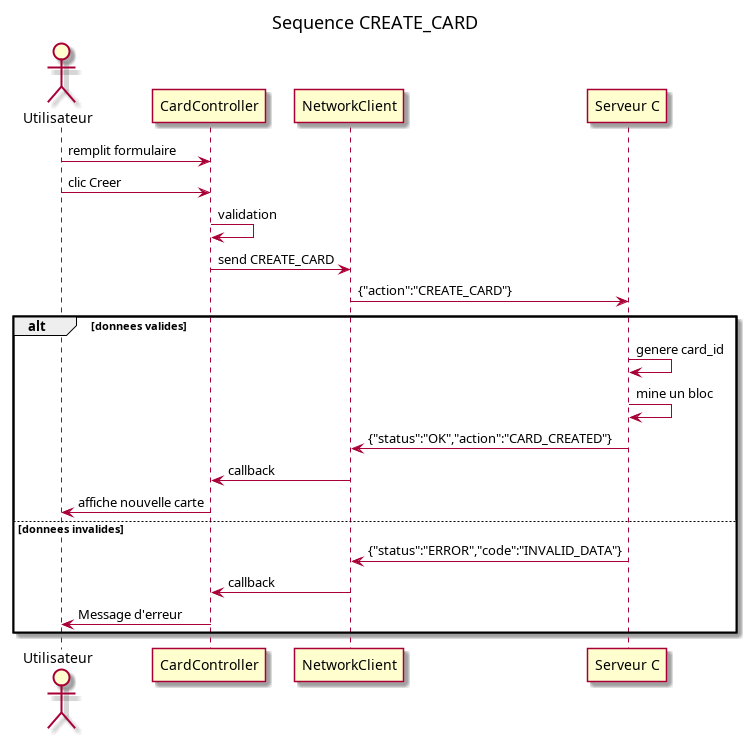
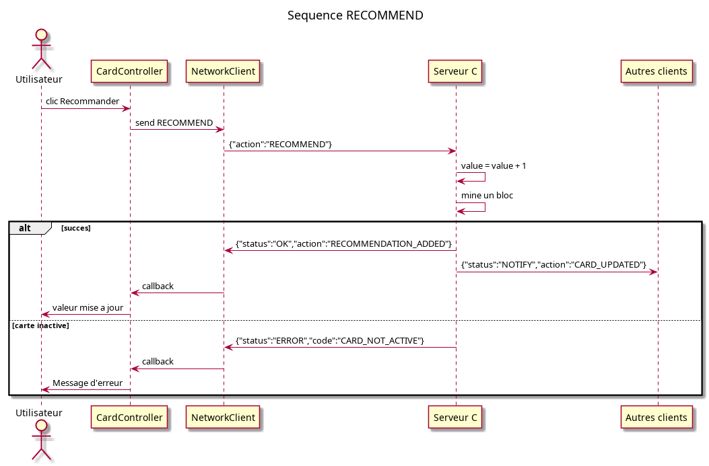
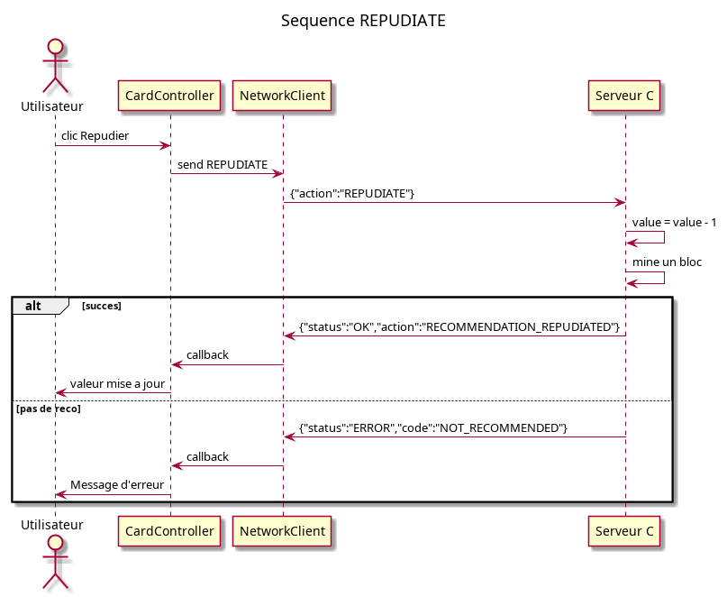
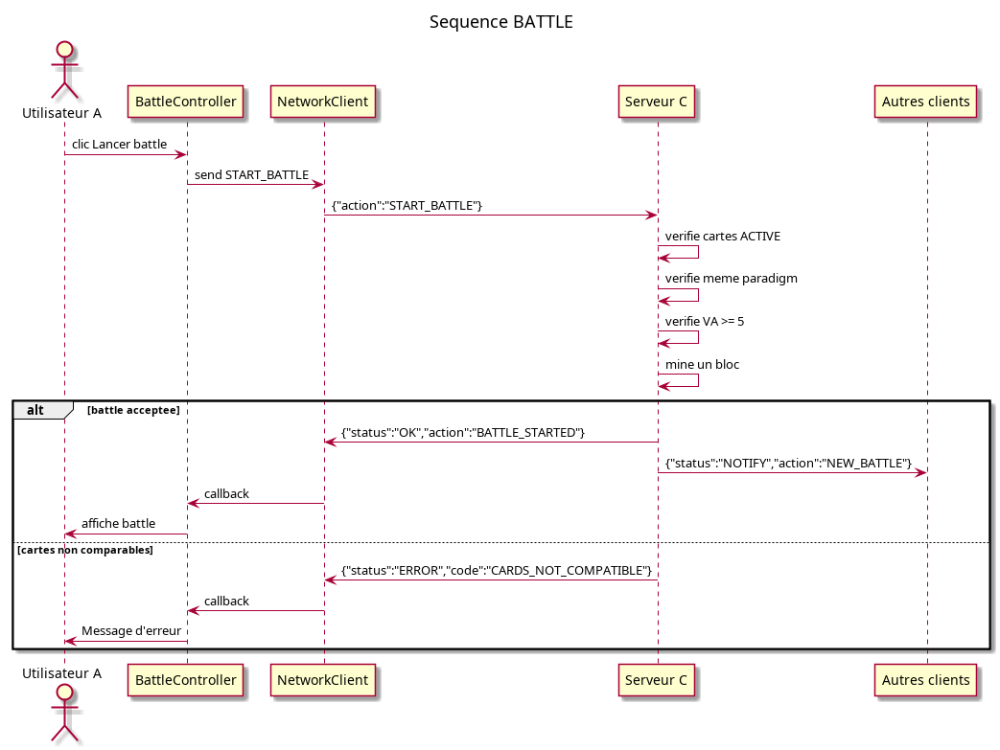
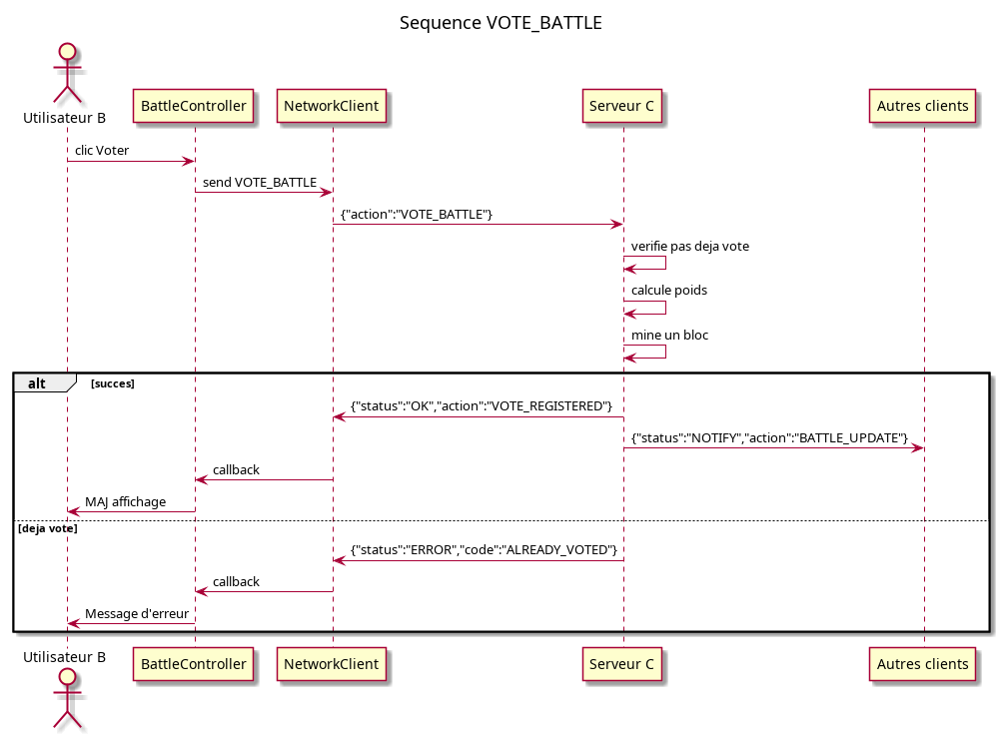
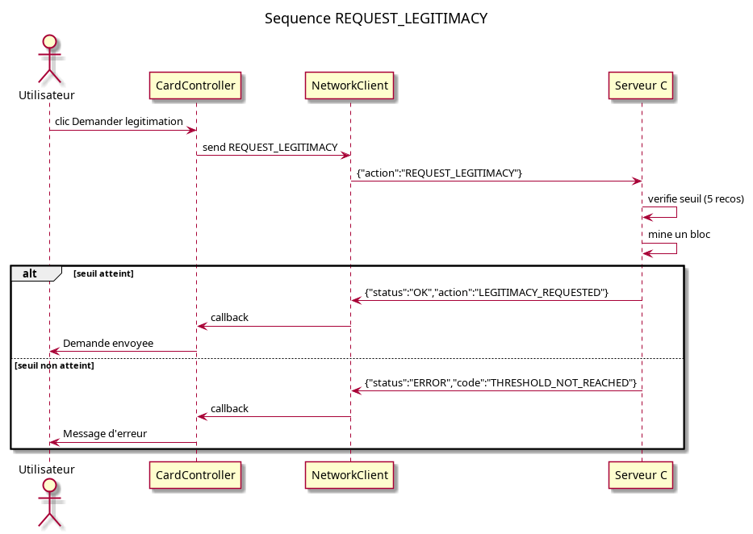
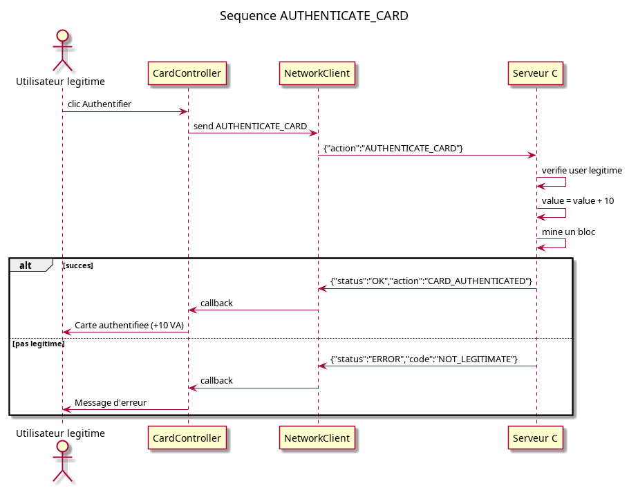
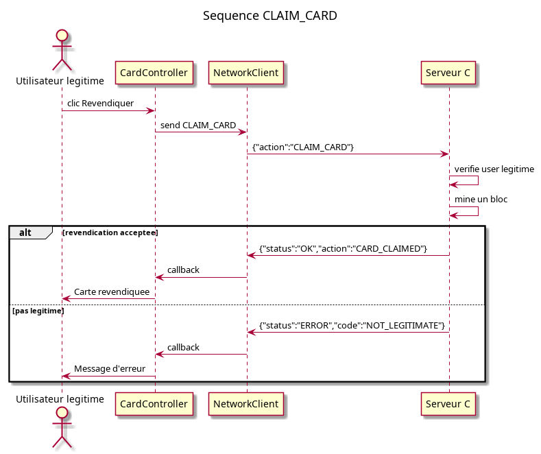
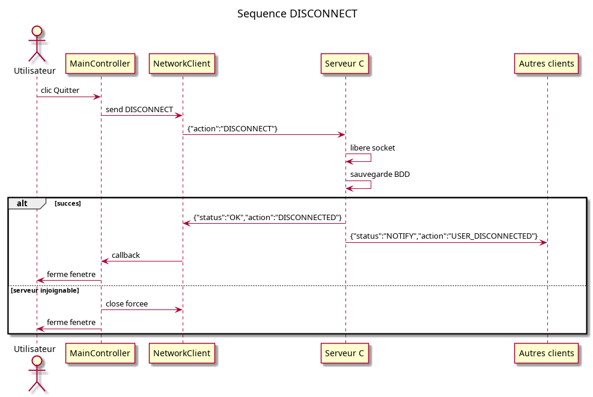

# Diagrammes de séquence — Client

> Scénarios côté client JavaFX.

## 1. Login

## 2. Création de carte

## 3. Recommandation

## 4. Répudiation

## 5. Battle

## 6. Vote

## 7. Légitimation

## 8. Authentification

## 9. Revendication

## 10. Déconnexion

