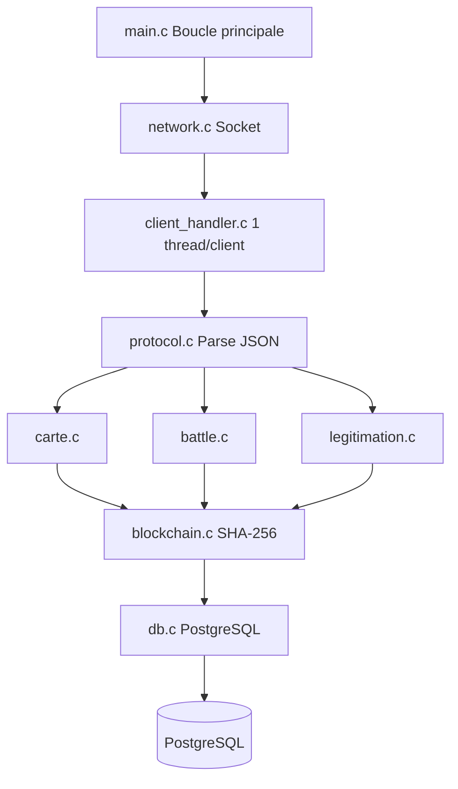
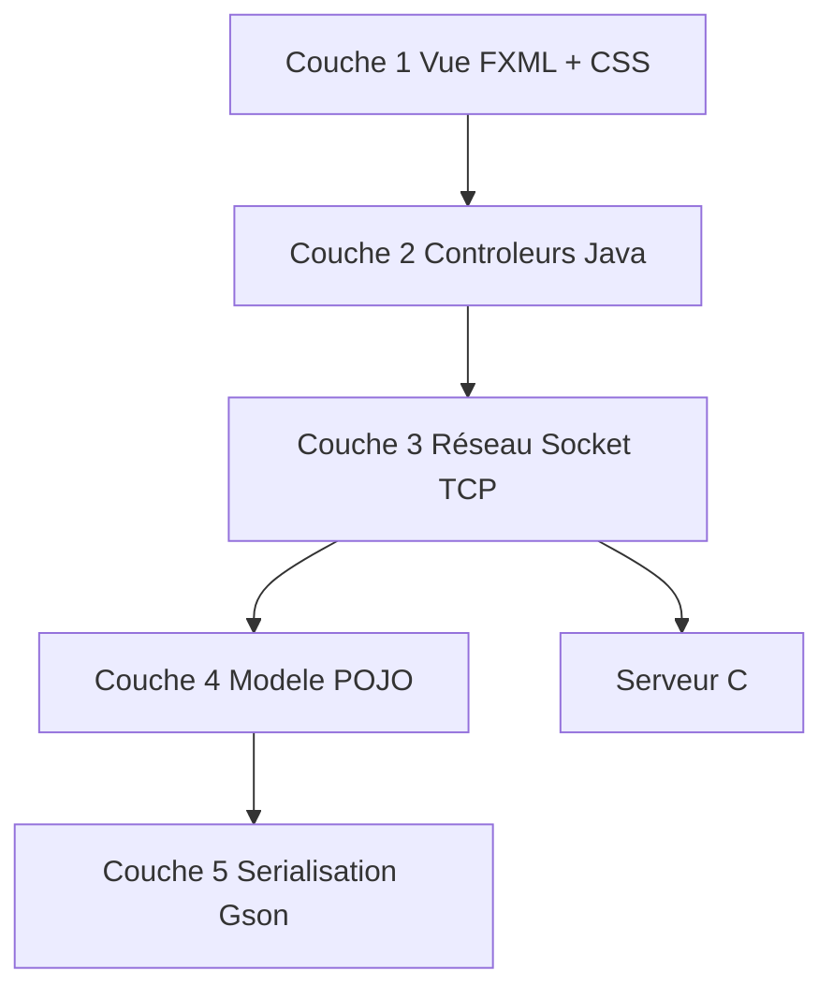
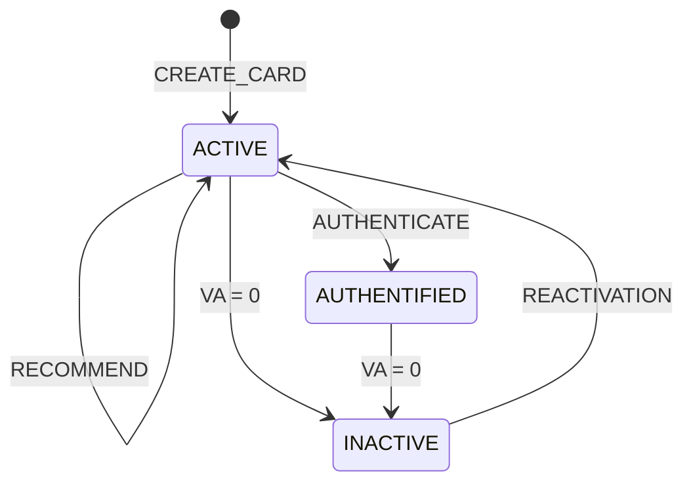

# 📄 Spécification technique — SAE-Recommender

**Projet :** SAÉ BUT2 S3 2026-2027  
**Thème :** Langages de programmation  
**Date :** 25 septembre 2026  
**Version :** 1.0

---

## 📑 Table des matières

1. [Introduction](#1-introduction)
2. [Répartition des rôles](#2-répartition-des-rôles)
3. [Architecture du serveur](#3-architecture-du-serveur)
4. [Architecture des clients](#4-architecture-des-clients)
5. [Organisation des données côté serveur](#5-organisation-des-données-côté-serveur)
6. [Organisation des données côté client](#6-organisation-des-données-côté-client)
7. [Schéma relationnel de la base de données](#7-schéma-relationnel-de-la-base-de-données)
8. [Structures de données de la blockchain](#8-structures-de-données-de-la-blockchain)
9. [Données associées](#9-données-associées)
10. [Règles métier](#10-règles-métier)
11. [Diagrammes de séquence](#11-diagrammes-de-séquence)
12. [Protocole applicatif](#12-protocole-applicatif)
13. [Cas d'erreur](#13-cas-derreur)
14. [Conclusion](#14-conclusion)
15. [Validation](#15-validation)

---

# 1. Introduction

## 1.1 Contexte

Ce document constitue la spécification technique du projet **SAE-Recommender**, réalisé dans le cadre de la SAÉ du troisième semestre du BUT Informatique (2026-2027).

## 1.2 Objectif du projet

L'objectif est de réaliser une plateforme client-serveur de recommandations structurée autour de cartes.

La plateforme s'appuie sur :

- Une communication par sockets TCP
- Un serveur multitâche en C
- Une blockchain privée simplifiée avec preuve de travail
- Une sauvegarde en base PostgreSQL
- Des tests unitaires
- Une interface graphique JavaFX

## 1.3 Thème choisi

Une carte représente un **langage de programmation**.

### Justification

- Cohérent avec la formation BUT Informatique
- Objet concret et vérifiable
- Facilite la description avec des critères objectifs
- Permet des battles pertinentes (comparaison de langages)
- Chaque langage possède un logo officiel

## 1.4 Technologies utilisées

| Technologie | Utilisation |
|---|---|
| Linux Debian | Environnement de développement |
| Langage C | Serveur + tests |
| Langage Java | Client + tests |
| JavaFX | Interface graphique |
| Blockchain | Traçabilité + intégrité |
| SHA-256 | Hashage |
| PostgreSQL | Base de données |
| Git | Versioning |

---

# 2. Répartition des rôles

## 2.1 Composition de l'équipe

| Membre | Partie | Technologies |
|---|---|---|
| Usman | Client Java + JavaFX + Tests | Java, JavaFX, JUnit, Gson |
| Omar | Client Java + JavaFX + Tests | Java, JavaFX, JUnit, Gson |
| Mai | Serveur C + Sockets + Tests | C, pthreads, sockets |
| Albine | Serveur C + Sockets + Tests | C, pthreads, sockets |
| Iyore | Blockchain + PostgreSQL | C, SHA-256, PostgreSQL |

## 2.2 Répartition des tâches Phase 1

| # | Tâche | Usman + Omar | Mai + Albine | Iyore |
|---:|---|---|---|---|
| 1 | Répartition des rôles | ✅ | ✅ | ✅ |
| 2 | Architecture du serveur | 🟠 Aide | ✅ Principal | — |
| 3 | Architecture des clients | ✅ Principal | — | — |
| 4 | Organisation données serveur | 🟠 Aide | ✅ Principal | 🟠 Aide |
| 5 | Organisation données client | ✅ Principal | — | 🟠 Validation |
| 6 | Schéma relationnel BDD | — | 🟠 Aide | ✅ Principal |
| 7 | Structures blockchain | — | 🟠 Aide | ✅ Principal |
| 8 | Données cartes/recos/battles | ✅ | ✅ | ✅ |
| 9 | Règles métier | ✅ | ✅ | ✅ |
| 10 | Diagrammes de séquence | ✅ Client | ✅ Serveur | 🟠 BDD |
| 11 | Protocole applicatif | ✅ Rédaction | ✅ Validation | — |
| 12 | Cas d'erreur | ✅ Client | ✅ Serveur | 🟠 BDD |

### Légende

- ✅ **Principal** : responsable
- 🟠 **Aide / Validation** : participe

---

# 3. Architecture du serveur

## 3.1 Vue d'ensemble

Le serveur C est structuré en modules pour séparer les responsabilités.



## 3.2 Modules du serveur

| Module | Fichier source | En-tête | Rôle |
|---|---|---|---|
| Boucle principale | `main.c` | — | Démarrage, arrêt |
| Réseau | `network.c` | `network.h` | Socket, bind, listen, accept |
| Client | `client_handler.c` | `client_handler.h` | 1 thread par client |
| Cartes | `carte.c` | `carte.h` | create, recommend, repudiate |
| Battles | `battle.c` | `battle.h` | launch, vote, apply_result |
| Légitimation | `legitimation.c` | `legitimation.h` | request, claim, authenticate |
| Blockchain | `blockchain.c` | `blockchain.h` | Blocs, SHA-256, PoW |
| Base de données | `db.c` | `db.h` | Connexion PostgreSQL |
| Protocole | `protocol.c` | `protocol.h` | Parse JSON, réponse JSON |
| Utilitaires | `utils.c` | `utils.h` | Fonctions communes |

## 3.3 Modèle de concurrence

Le serveur utilise un modèle **multithread (`pthreads`)** plutôt qu'un modèle multiprocessus (`fork`).

### Justification

- Besoin de partager en mémoire la blockchain et les listes de cartes
- Les threads d'un même processus partagent naturellement le même espace mémoire
- Évite la complexité de la mémoire partagée inter-processus

## 3.4 Boucle principale

1. Création du socket
2. `bind()` sur l'adresse IP et le port
3. `listen()` pour écouter
4. Restauration du contexte depuis PostgreSQL
5. Boucle `accept()` pour accepter les clients
6. Création d'un thread par client (`pthread_create`)
7. Le serveur retourne immédiatement à `accept()`

## 3.5 Traitement non bloquant

Chaque thread client est indépendant :

- Un calcul long (minage) ne bloque pas les autres clients
- La boucle principale accepte rapidement les nouvelles connexions
- Le serveur reste réactif

## 3.6 Limite de connexions

- `MAX_CLIENTS = 10` clients simultanés
- Au-delà, la connexion est acceptée puis rejetée avec un message d'erreur
- Message : `{"status":"ERROR","code":"SERVER_BUSY"}`

## 3.7 Synchronisation

Les structures partagées sont protégées par des mutex :

| Structure | Mutex | Protection |
|---|---|---|
| Liste cartes | `mutex_cartes` | Lecture/écriture |
| Liste utilisateurs | `mutex_utilisateurs` | Lecture/écriture |
| Liste battles | `mutex_battles` | Lecture/écriture |
| Blockchain | `mutex_blockchain` | Minage + ajout |

**Principe :** toute section critique est encadrée par `pthread_mutex_lock()` / `pthread_mutex_unlock()`.

---

# 4. Architecture des clients

## 4.1 Vue d'ensemble

Le client Java est structuré en **5 couches**.



## 4.2 Rôle de chaque couche

| Couche | Technologie | Rôle | Contrainte |
|---|---|---|---|
| 1 — Vue | JavaFX, FXML, CSS | Afficher les écrans, capturer les clics | Aucune logique métier |
| 2 — Contrôleurs | Java, JavaFX | Lire les champs, appeler NetworkClient, MAJ UI | Utiliser `Platform.runLater()` |
| 3 — Réseau | `java.net.Socket` | Ouvrir le socket, envoyer, écouter | Thread séparé pour `listenLoop` |
| 4 — Modèle | POJO Java | Représenter les données | Sérialisables en JSON |
| 5 — Sérialisation | Gson | Convertir objet Java ↔ JSON | Noms de champs identiques |

## 4.3 Liste des fichiers FXML

| Fichier | Écran | Contrôleur |
|---|---|---|
| `login.fxml` | Connexion | `LoginController` |
| `main.fxml` | Fenêtre principale | `MainController` |
| `cards.fxml` | Onglet Cartes | `CardController` |
| `card_view.fxml` | Composant carte | `CardViewController` |
| `create_card.fxml` | Dialog création | `CreateCardController` |
| `my_cards.fxml` | Mes cartes | `CardController` |
| `recommendations.fxml` | Recommandations | `RecommendationController` |
| `battles.fxml` | Battles | `BattleController` |
| `profile.fxml` | Profil | `ProfileController` |

---

# 5. Organisation des données côté serveur

## 5.1 Structures C

### Carte

```c
typedef struct {
    int id;
    char title[100];
    char paradigm[30];
    char description[500];
    char typing[20];
    char difficulty[20];
    int year_created;
    char image_url[500];
    int creator_id;
    int owner_id;
    char status[20];
    int value;
    int is_authenticated;
    int win_count;
    long created_at;
} Carte;
```

### Utilisateur

```c
typedef struct {
    int id;
    char username[50];
    int socket_fd;
    pthread_t thread_id;
    int connected;
    int reco_count;
    int legitimacy_count;
} Utilisateur;
```

### Recommandation

```c
typedef struct {
    int id;
    int user_id;
    int card_id;
    int active;
    long timestamp;
} Recommandation;
```

### Battle

```c
typedef struct {
    int id;
    int card1_id;
    int card2_id;
    int winner_id;
    int status;
    int card1_votes;
    int card2_votes;
    long started_at;
    long ended_at;
} Battle;
```

### Vote

```c
typedef struct {
    int id;
    int battle_id;
    int user_id;
    int card_id;
    int weight;
} Vote;
```

### ActionCarte

```c
typedef struct {
    int id;
    int card_id;
    int user_id;
    int type;         /* 0=legitimation, 1=revendication, 2=authentification */
    int status;       /* 0=en attente, 1=acceptee, 2=refusee */
    long requested_at;
    long granted_at;
} ActionCarte;
```

## 5.2 Conteneurs globaux

```c
Carte *liste_cartes;
int nb_cartes;

Utilisateur *liste_utilisateurs;
int nb_utilisateurs;

Battle *liste_battles;
int nb_battles;
```

Chaque liste est protégée par son propre mutex.

## 5.3 Lien avec la blockchain

Les structures en mémoire sont dérivées de la blockchain :

- Jamais source de vérité définitive
- Reconstruction optimisée pour un accès rapide
- Toute modification validée → d'abord dans un bloc, puis en mémoire

---

# 6. Organisation des données côté client

## 6.1 Vue d'ensemble

Le client organise ses données en **3 catégories**.

| Catégorie | Classes | Rôle |
|---|---|---|
| Modèle métier | `Card`, `User`, `Recommendation`, `Battle`, `Vote`, `Legitimacy` | Représenter les objets |
| Communication | `Request`, `Response` | Encapsuler les messages JSON |
| Réseau | `NetworkClient` | Gérer le socket TCP |

## 6.2 Classe Card

| Champ | Type | Description |
|---|---|---|
| `id` | String | Identifiant (`c_001`) |
| `title` | String | Nom du langage |
| `paradigm` | String | OBJECT, FUNCTIONAL, MULTI… |
| `description` | String | Description |
| `typing` | String | STATIC, DYNAMIC… |
| `difficulty` | String | BEGINNER, INTERMEDIATE… |
| `yearCreated` | int | Année de création |
| `imageUrl` | String | URL du logo |
| `creator` | String | Créateur (`u_001`) |
| `owner` | String | Propriétaire courant |
| `status` | String | ACTIVE ou INACTIVE |
| `value` | int | Nombre de recos (VA) |
| `isAuthenticated` | boolean | Authentifiée ? |
| `authenticatedBy` | String | Qui a authentifié |
| `authenticatedAt` | String | Quand |
| `winCount` | int | Victoires en battle |
| `isLegitimate` | boolean | Propriétaire légitime ? |
| `stakeVA` | int | VA engagée |
| `createdAt` | String | Date (ISO 8601) |

## 6.3 Classe User

| Champ | Type | Description |
|---|---|---|
| `id` | String | Identifiant (`u_001`) |
| `username` | String | Pseudo |
| `isBot` | boolean | Est-ce un bot ? |
| `recoCount` | int | Recos émises |
| `legitimacyCount` | int | Légitimations obtenues |

## 6.4 Classe Battle

| Champ | Type | Description |
|---|---|---|
| `id` | String | Identifiant (`b_001`) |
| `card1Id` | String | Carte 1 |
| `card2Id` | String | Carte 2 |
| `card1VA` | int | VA carte 1 |
| `card2VA` | int | VA carte 2 |
| `card1Votes` | int | Votes pondérés carte 1 |
| `card2Votes` | int | Votes pondérés carte 2 |
| `duration` | int | Durée (60 secondes) |
| `endTime` | String | Heure de fin |
| `status` | String | EN_COURS, TERMINEE |
| `winnerId` | String | Gagnant |

## 6.5 Classe Vote

| Champ | Type | Description |
|---|---|---|
| `battleId` | String | Battle concernée |
| `userId` | String | Votant |
| `cardId` | String | Carte choisie |
| `weight` | int | Poids du vote |
| `signature` | String | Signature SHA-256 |
| `votedAt` | String | Date du vote |

## 6.6 Classe Legitimacy

| Champ | Type | Description |
|---|---|---|
| `id` | String | Identifiant |
| `cardId` | String | Carte concernée |
| `userId` | String | Utilisateur |
| `status` | String | PENDING, GRANTED, REJECTED |
| `requestedAt` | String | Date de demande |
| `grantedAt` | String | Date d'accord |

## 6.7 Classes Request / Response

```java
Request  : { action, payload }
Response : { status, action, data, code, message }
```

## 6.8 Stockage côté client

Le client ne stocke rien de manière permanente :

- Données en mémoire (`ObservableList` JavaFX)
- Rechargement à chaque connexion (`CONTEXT_RESTORED`)
- Aucun accès à la base de données

---

# 7. Schéma relationnel de la base de données

## 7.1 Vue d'ensemble

La base PostgreSQL contient **7 tables**.

## 7.2 Table `users`

| Champ | Type | Contrainte |
|---|---|---|
| `id` | SERIAL | PRIMARY KEY |
| `username` | VARCHAR(50) | UNIQUE, NOT NULL |
| `is_bot` | BOOLEAN | DEFAULT FALSE |
| `reco_count` | INT | DEFAULT 0 |
| `legitimacy_count` | INT | DEFAULT 0 |
| `created_at` | TIMESTAMP | DEFAULT NOW() |

## 7.3 Table `cards`

| Champ | Type | Contrainte |
|---|---|---|
| `id` | SERIAL | PRIMARY KEY |
| `title` | VARCHAR(100) | NOT NULL |
| `paradigm` | VARCHAR(30) | NOT NULL |
| `description` | TEXT | |
| `typing` | VARCHAR(20) | |
| `difficulty` | VARCHAR(20) | |
| `year_created` | INT | |
| `image_url` | VARCHAR(500) | |
| `creator_id` | INT | REFERENCES `users(id)` |
| `owner_id` | INT | REFERENCES `users(id)` |
| `status` | VARCHAR(20) | DEFAULT 'ACTIVE' |
| `value` | INT | DEFAULT 0 |
| `is_authenticated` | BOOLEAN | DEFAULT FALSE |
| `authenticated_by` | INT | REFERENCES `users(id)` |
| `win_count` | INT | DEFAULT 0 |
| `is_legitimate` | BOOLEAN | DEFAULT FALSE |
| `stake_va` | INT | DEFAULT 0 |
| `created_at` | TIMESTAMP | DEFAULT NOW() |

## 7.4 Table `recommendations`

| Champ | Type | Contrainte |
|---|---|---|
| `id` | SERIAL | PRIMARY KEY |
| `card_id` | INT | REFERENCES `cards(id)` |
| `user_id` | INT | REFERENCES `users(id)` |
| `active` | BOOLEAN | DEFAULT TRUE |
| `created_at` | TIMESTAMP | DEFAULT NOW() |

## 7.5 Table `battles`

| Champ | Type | Contrainte |
|---|---|---|
| `id` | SERIAL | PRIMARY KEY |
| `card1_id` | INT | REFERENCES `cards(id)` |
| `card2_id` | INT | REFERENCES `cards(id)` |
| `winner_id` | INT | |
| `status` | VARCHAR(20) | |
| `started_at` | TIMESTAMP | |
| `ended_at` | TIMESTAMP | |

## 7.6 Table `votes`

| Champ | Type | Contrainte |
|---|---|---|
| `id` | SERIAL | PRIMARY KEY |
| `battle_id` | INT | REFERENCES `battles(id)` |
| `user_id` | INT | REFERENCES `users(id)` |
| `card_id` | INT | REFERENCES `cards(id)` |
| `weight` | INT | DEFAULT 1 |
| `signature` | VARCHAR(256) | |
| `voted_at` | TIMESTAMP | DEFAULT NOW() |

## 7.7 Table `legitimacies`

| Champ | Type | Contrainte |
|---|---|---|
| `id` | SERIAL | PRIMARY KEY |
| `card_id` | INT | REFERENCES `cards(id)` |
| `user_id` | INT | REFERENCES `users(id)` |
| `status` | VARCHAR(20) | |
| `requested_at` | TIMESTAMP | |
| `granted_at` | TIMESTAMP | |

## 7.8 Table `blocks`

| Champ | Type | Contrainte |
|---|---|---|
| `id` | SERIAL | PRIMARY KEY |
| `timestamp` | BIGINT | NOT NULL |
| `data` | JSONB | NOT NULL |
| `prev_hash` | CHAR(64) | |
| `nonce` | BIGINT | |
| `hash` | CHAR(64) | |

---

# 8. Structures de données de la blockchain

## 8.1 Structure d'un bloc

```c
typedef struct {
    int id;
    long timestamp;
    char data[1024];
    char prev_hash[65];
    int nonce;
    char hash[65];
} Block;
```

| Champ | Type | Description |
|---|---|---|
| `id` | int | Identifiant unique |
| `timestamp` | long | Date de création (epoch) |
| `data` | char[1024] | Données de l'action (JSON) |
| `prev_hash` | char[65] | Hash du bloc précédent |
| `nonce` | int | Preuve de travail |
| `hash` | char[65] | Hash courant |

## 8.2 Bloc genesis

Le premier bloc de la blockchain :

- `id = 0`
- `prev_hash = "0000000000000000000000000000000000000000000000000000000000000000"`
- `nonce = 0`
- `hash = SHA-256(data + prev_hash + nonce)`

## 8.3 Calcul du hash

```text
hash = SHA-256(data + prev_hash + nonce)
```

- **Algorithme :** SHA-256
- **Sortie :** 64 caractères hexadécimaux

## 8.4 Preuve de travail (PoW)

Le minage consiste à faire varier le nonce jusqu'à obtenir un hash respectant un motif.

- **Motif :** N zéros au début du hash
- **Difficulté :** 3 ou 4

Exemple pour difficulté = 3 :

```text
000abc123...  ✅ Valide
00abc1234...  ❌ Invalide
```

## 8.5 Vérification de la cohérence

La fonction `verify_blockchain()` contrôle :

| # | Contrôle | Description |
|---:|---|---|
| 1 | Validité du hash | `hash == SHA-256(data + prev_hash + nonce)` |
| 2 | Cohérence du `prev_hash` | `block[i].prev_hash == block[i-1].hash` |
| 3 | Preuve de travail | Le hash commence par N zéros |
| 4 | Détection de modification | Si un champ est modifié, le hash change |

---

# 9. Données associées

## 9.1 Carte (langage)

| Donnée | Type | Règle |
|---|---|---|
| `id` | String | Généré serveur |
| `title` | String | 1-100 caractères |
| `paradigm` | Enum | OBJECT, FUNCTIONAL, MULTI… |
| `description` | String | 1-500 caractères |
| `typing` | Enum | STATIC, DYNAMIC… |
| `difficulty` | Enum | BEGINNER, INTERMEDIATE… |
| `yearCreated` | int | 1950-2030 |
| `imageUrl` | String | URL valide |
| `creator` | String | `u_XXX` |
| `owner` | String | `u_XXX` |
| `status` | Enum | ACTIVE, INACTIVE |
| `value` | int | Nombre de recos |
| `isAuthenticated` | boolean | false par défaut |
| `winCount` | int | 0 par défaut |
| `isLegitimate` | boolean | false par défaut |
| `stakeVA` | int | 0 par défaut |
| `createdAt` | String | ISO 8601 |

## 9.2 Recommandation

| Donnée | Type | Règle |
|---|---|---|
| `cardId` | String | `c_XXX` |
| `userId` | String | `u_XXX` |
| `date` | String | ISO 8601 |
| `active` | boolean | true |

**Impact :** +1 VA sur la carte.

## 9.3 Battle

| Donnée | Type | Règle |
|---|---|---|
| `id` | String | `b_XXX` |
| `card1Id` | String | `c_XXX` |
| `card2Id` | String | `c_XXX` |
| `card1Votes` | int | Poids cumulés |
| `card2Votes` | int | Poids cumulés |
| `duration` | int | 60 secondes |
| `status` | String | EN_COURS, TERMINEE |
| `winnerId` | String | `c_XXX` |

## 9.4 Vote

| Donnée | Type | Règle |
|---|---|---|
| `battleId` | String | `b_XXX` |
| `userId` | String | `u_XXX` |
| `cardId` | String | `c_XXX` |
| `weight` | int | Nb recos émises (min 1) |
| `signature` | String | SHA-256 |
| `votedAt` | String | ISO 8601 |

## 9.5 Légitimation

| Donnée | Type | Règle |
|---|---|---|
| `id` | String | `l_XXX` |
| `cardId` | String | `c_XXX` |
| `userId` | String | `u_XXX` |
| `status` | String | PENDING, GRANTED, REJECTED |
| `requestedAt` | String | ISO 8601 |
| `grantedAt` | String | ISO 8601 |

## 9.6 Revendication

| Donnée | Type | Règle |
|---|---|---|
| `id` | String | `l_XXX` |
| `cardId` | String | `c_XXX` |
| `userId` | String | `u_XXX` |
| `status` | String | PENDING, GRANTED, REJECTED |
| `requestedAt` | String | ISO 8601 |

## 9.7 Authentification

| Donnée | Type | Règle |
|---|---|---|
| `cardId` | String | `c_XXX` |
| `authenticatedBy` | String | `u_XXX` |
| `authenticatedAt` | String | ISO 8601 |

**Impact :** +10 VA + statut `AUTHENTIFIED`.

## 9.8 Partage ciblé (optionnel)

| Donnée | Type | Règle |
|---|---|---|
| `sharedBy` | String | `u_XXX` |
| `sharedTo` | String | `u_XXX` |
| `sharedAt` | String | ISO 8601 |
| `accepted` | boolean | null |

---

# 10. Règles métier

## 10.1 Valeur d'une carte (VA)

| Action | Impact |
|---|---|
| 1 reco active | +1 VA |
| 1 authentification | +10 VA |
| Victoire en battle | +50 % des recos du perdant |
| Défaite en battle | -50 % des recos |

### Formule

```text
VA = nb_recos_actives + (10 × auth) + transferts_battle
```

## 10.2 Valeur d'un utilisateur

```text
VA(user) = Σ VA(cartes possédées)
```

## 10.3 Critère de proximité (battle)

Deux cartes peuvent se battre si elles ont le **même paradigm**.

## 10.4 Légitimation

| Condition | Détail |
|---|---|
| Seuil | 5 recos valides |
| Alternative | Validation du créateur |
| Droits | Authentifier + Revendiquer |

## 10.5 Battle

| Règle | Valeur |
|---|---|
| Nombre de cartes | 2 |
| Statut | ACTIVE |
| Paradigme | Identique |
| VA minimum | 5 |
| Durée | 60 secondes |
| Vote | 1 par user |
| Pondération | Nb recos (min 1) |
| Égalité | VA la plus élevée |
| Transfert | 50 % des recos |
| Carte perdante | INACTIVE si VA = 0 |

## 10.6 Authentification

| Règle | Valeur |
|---|---|
| Acteur | Légitime |
| Impact | +10 VA |
| Statut | AUTHENTIFIED |
| Effet | Verrouillage |

## 10.7 Revendication

| Règle | Valeur |
|---|---|
| Demandeur | Légitime |
| Cible | Non-légitime |
| Délai | 10 blocs |

## 10.8 Cycle de vie



**Document complet :** `regles-metier.md`

---

# 11. Diagrammes de séquence

## 11.1 LOGIN

`diagrammes/07-seq-login.png`

## 11.2 CREATE_CARD

`diagrammes/08-seq-create-card.png`

## 11.3 RECOMMEND

`diagrammes/09-seq-recommend.png`

## 11.4 BATTLE

`diagrammes/10-seq-battle.png`

## 11.5 LÉGITIMATION

`diagrammes/11-seq-legitimation.png`

## 11.6 AUTHENTIFICATION

`diagrammes/12-seq-authentification.png`

## 11.7 REVENDICATION

`diagrammes/13-seq-revendication.png`

## 11.8 DISCONNECT

`diagrammes/14-seq-disconnect.png`

---

# 12. Protocole applicatif

## 12.1 Format général

| Élément | Valeur |
|---|---|
| Format | JSON |
| Encodage | UTF-8 |
| Délimiteur | `\n` |
| Transport | Socket TCP |

## 12.2 Structure

### Requête

```json
{"action":"LOGIN","payload":{"username":"usman"}}
```

### Réponse OK

```json
{"status":"OK","action":"LOGIN_SUCCESS","data":{...}}
```

### Réponse ERROR

```json
{"status":"ERROR","code":"USERNAME_TAKEN","message":"..."}
```

### Notification

```json
{"status":"NOTIFY","action":"CARD_UPDATED","data":{...}}
```

## 12.3 Liste des actions

| # | Action | Description |
|---:|---|---|
| 1 | `LOGIN` | Connexion |
| 2 | `GET_CONTEXT` | Récupérer le contexte |
| 3 | `CREATE_CARD` | Créer une carte |
| 4 | `RECOMMEND` | Recommander |
| 5 | `REPUDIATE` | Répudier |
| 6 | `START_BATTLE` | Lancer battle |
| 7 | `VOTE_BATTLE` | Voter |
| 8 | `REQUEST_LEGITIMACY` | Demander légitimation |
| 9 | `CLAIM_CARD` | Revendiquer |
| 10 | `AUTHENTICATE_CARD` | Authentifier |
| 11 | `DISCONNECT` | Déconnexion |

**Document complet :** `protocole-applicatif.md`

---

# 13. Cas d'erreur

## 13.1 Liste complète

| # | Code | Signification |
|---:|---|---|
| 1 | `INVALID_DATA` | Champs invalides |
| 2 | `USERNAME_TAKEN` | Pseudo pris |
| 3 | `CARD_NOT_FOUND` | Carte inexistante |
| 4 | `CARD_NOT_ACTIVE` | Carte inactive |
| 5 | `DUPLICATE_CARD` | Carte existante |
| 6 | `ALREADY_RECOMMENDED` | Déjà recommandée |
| 7 | `NOT_RECOMMENDED` | Rien à répudier |
| 8 | `BATTLE_NOT_FOUND` | Battle inexistante |
| 9 | `BATTLE_ALREADY_ACTIVE` | Carte en battle |
| 10 | `ALREADY_VOTED` | Déjà voté |
| 11 | `NOT_LEGITIMATE` | Non légitime |
| 12 | `THRESHOLD_NOT_REACHED` | Seuil non atteint |
| 13 | `CARDS_NOT_COMPATIBLE` | Paradigmes différents |
| 14 | `VA_TOO_LOW` | VA < 5 |
| 15 | `ALREADY_AUTHENTICATED` | Déjà authentifiée |
| 16 | `SERVER_BUSY` | Serveur plein |
| 17 | `INTERNAL_ERROR` | Erreur interne |

**Document complet :** `cas-erreur.md`

---

# 14. Conclusion

## 14.1 Récapitulatif

Ce document a présenté la spécification technique complète du projet **SAE-Recommender** :

- **Architecture serveur :** modulaire, multitâche, avec mutex
- **Architecture client :** 5 couches (Vue, Contrôleur, Réseau, Modèle, Sérialisation)
- **Organisation des données :** côté serveur (C) et côté client (Java)
- **Schéma relationnel :** 7 tables PostgreSQL
- **Blockchain :** structure de bloc, SHA-256, PoW
- **Règles métier :** VA, légitimation, battle, authentification
- **Diagrammes de séquence :** 8 scénarios principaux
- **Protocole applicatif :** JSON + socket TCP
- **Cas d'erreur :** 17 codes serveur + 7 client

## 14.2 Livrables Phase 1

| # | Livrable | Statut |
|---:|---|---|
| 1 | Répartition des rôles | ✅ |
| 2 | Architecture du serveur | ✅ |
| 3 | Architecture des clients | ✅ |
| 4 | Organisation des données serveur | ✅ |
| 5 | Organisation des données client | ✅ |
| 6 | Schéma relationnel BDD | ✅ |
| 7 | Structures blockchain | ✅ |
| 8 | Données associées | ✅ |
| 9 | Règles métier | ✅ |
| 10 | Diagrammes de séquence | ✅ |
| 11 | Protocole applicatif | ✅ |
| 12 | Cas d'erreur | ✅ |

## 14.3 Prochaines étapes

- **Phase 2 :** Codage et tests — 5 octobre 2026 → 18 décembre 2026
- **Phase 3 :** Qualité — 4 janvier 2027 → 15 janvier 2027
- **Phase 4 :** Présentation — 18 janvier 2027 → 19 janvier 2027

---

# 15. Validation

| Rôle | Nom | Date | Statut |
|---|---|---|---|
| Client Java | Usman | 25/09/2026 | ✅ |
| Client Java | Omar | 25/09/2026 | ⏳ |
| Serveur C | Mai | 25/09/2026 | ⏳ |
| Serveur C | Albine | 25/09/2026 | ⏳ |
| Blockchain + BDD | Iyore | 25/09/2026 | ⏳ |

---

**Fin du document.**
