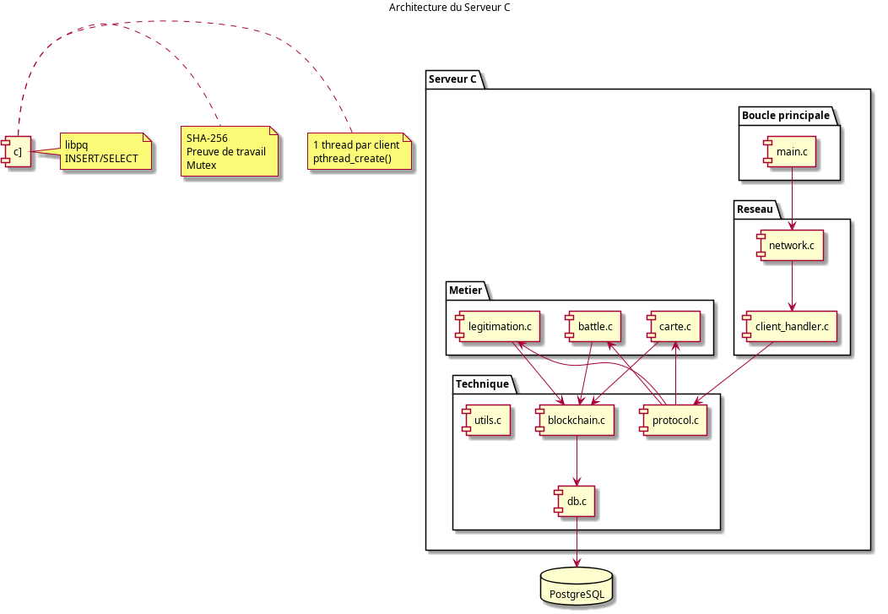
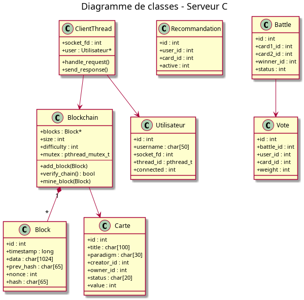

# Architecture du serveur

> Serveur C multitâche de la plateforme SAE-Recommender.

## 1. Vue d'ensemble

Le serveur est un processus C unique, multitâche (pthreads), qui communique
avec les clients par sockets TCP.

## 2. Modules du serveur

| Module | Fichier source | En-tête | Rôle |
|---|---|---|---|
| Boucle principale | `main.c` | — | Démarrage, arrêt |
| Réseau | `network.c` | `network.h` | Socket, bind, listen, accept |
| Client | `client_handler.c` | `client_handler.h` | 1 thread par client |
| Cartes | `carte.c` | `carte.h` | create, recommend, repudiate |
| Battles | `battle.c` | `battle.h` | launch, vote, apply_result |
| Légitimation | `legitimation.c` | `legitimation.h` | request, claim, authenticate |
| Blockchain | `blockchain.c` | `blockchain.h` | Blocs, SHA-256, PoW |
| Base de données | `db.c` | `db.h` | Connexion PostgreSQL |
| Protocole | `protocol.c` | `protocol.h` | Parse JSON, réponse JSON |
| Utilitaires | `utils.c` | `utils.h` | Fonctions communes |

## 3. Modèle de concurrence

Le serveur utilise un modèle **multithread (pthreads)** plutôt qu'un modèle
multiprocessus (fork).

**Justification :**
- Besoin de partager en mémoire la blockchain et les listes de cartes
- Les threads d'un même processus partagent naturellement le même espace mémoire
- Évite la complexité de la mémoire partagée inter-processus

## 4. Boucle principale

1. Création du socket
2. `bind()` sur l'adresse IP et le port
3. `listen()` pour écouter
4. Restauration du contexte depuis PostgreSQL
5. Boucle `accept()` pour accepter les clients
6. Création d'un thread par client (`pthread_create`)
7. Le serveur retourne immédiatement à `accept()`

## 5. Traitement non bloquant

Chaque thread client est indépendant :
- Un calcul long (minage) ne bloque pas les autres clients
- La boucle principale accepte rapidement les nouvelles connexions
- Le serveur reste réactif

## 6. Limite de connexions

- `MAX_CLIENTS = 10` clients simultanés
- Au-delà, la connexion est acceptée puis rejetée avec un message d'erreur
- Message : `{"status":"ERROR","code":"SERVER_BUSY"}`

## 7. Synchronisation

Les structures partagées sont protégées par des mutex :

| Structure | Mutex | Protection |
|---|---|---|
| Liste cartes | `mutex_cartes` | Lecture/écriture |
| Liste utilisateurs | `mutex_utilisateurs` | Lecture/écriture |
| Liste battles | `mutex_battles` | Lecture/écriture |
| Blockchain | `mutex_blockchain` | Minage + ajout |

**Principe :** toute section critique est encadrée par
`pthread_mutex_lock()` / `pthread_mutex_unlock()`.

## 8. Diagramme de classes

## 9. Cas d'utilisation serveur

## 10. Contraintes de qualité

- Aucune fonction C ne dépasse 200 lignes
- Commentaires en anglais
- En-tête de documentation pour chaque fonction
- Tests unitaires en C (assert)
