# Diagrammes de séquence — Serveur

> Scénarios côté serveur C.

## 1. Login

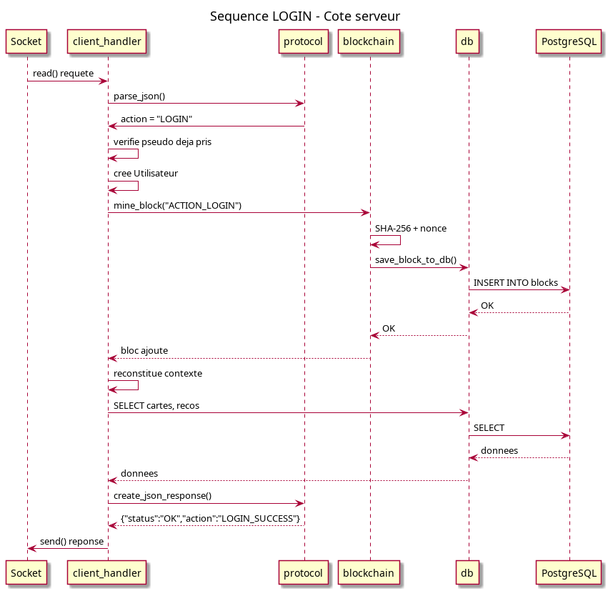

## 2. Création de carte

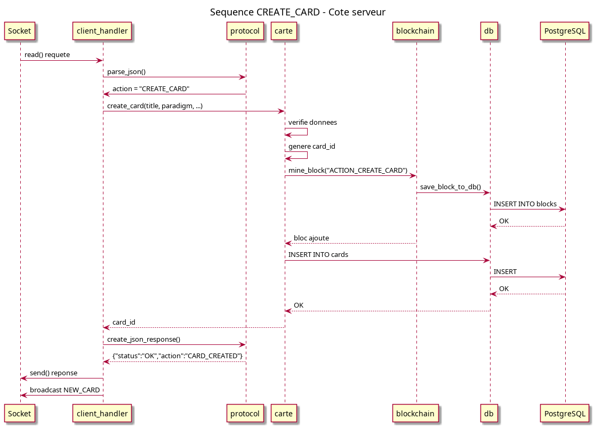

## 3. Recommandation

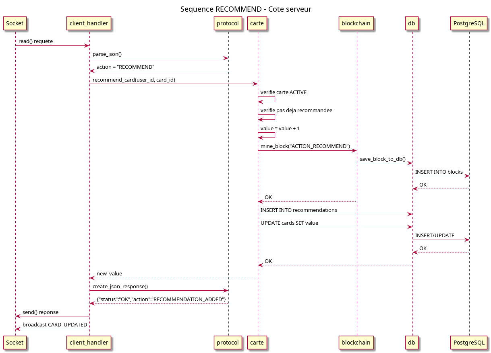

## 4. Battle

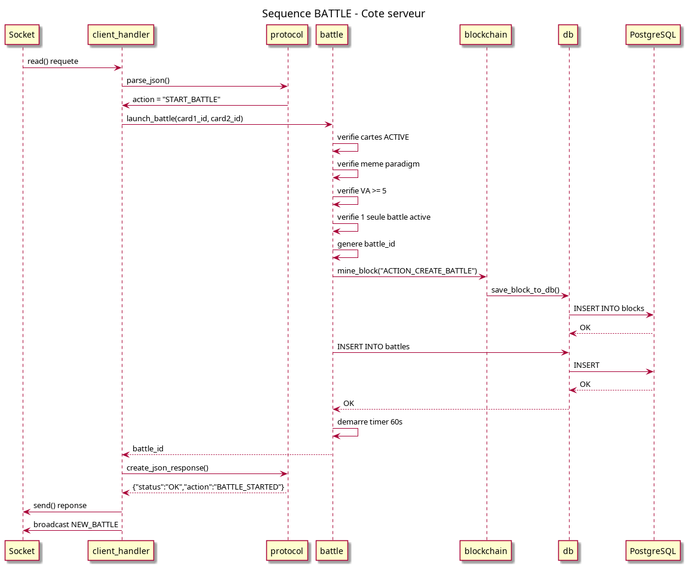

## 5. Vote

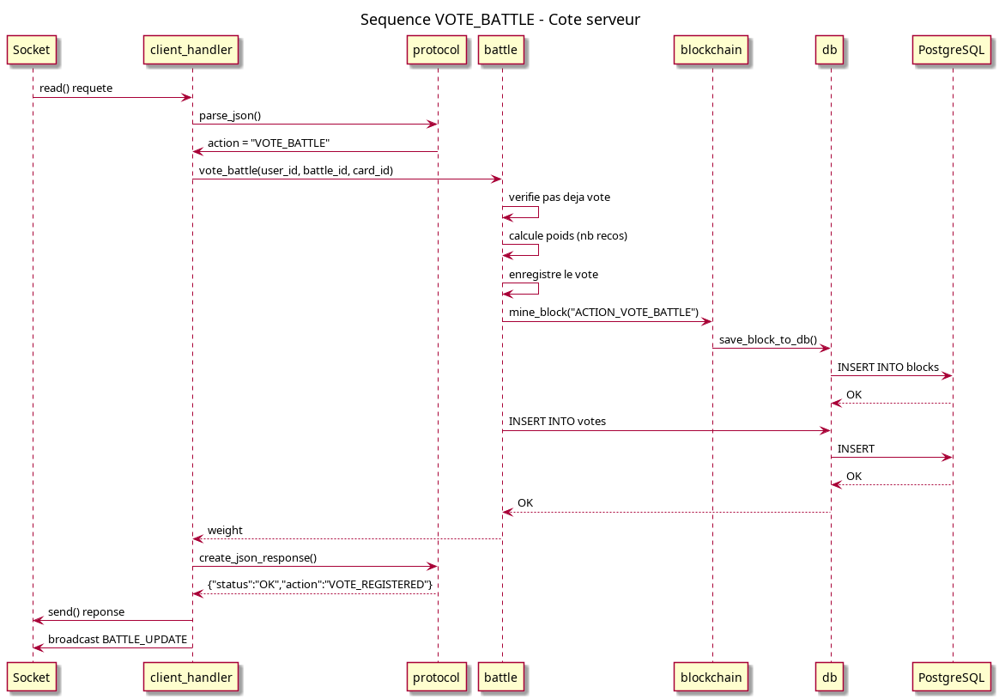

## 6. Résultat de battle

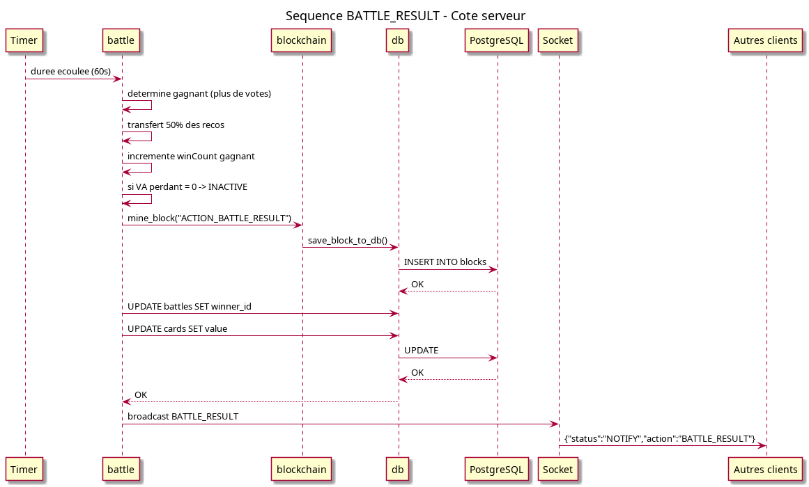

## 7. Légitimation

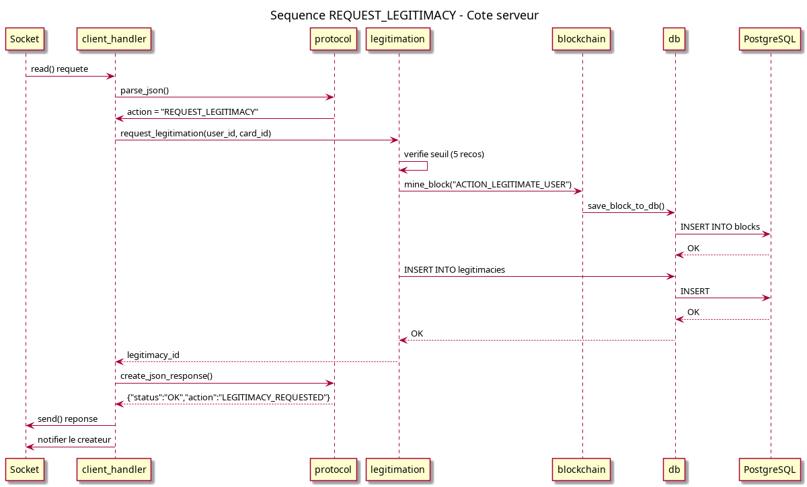

## 8. Authentification

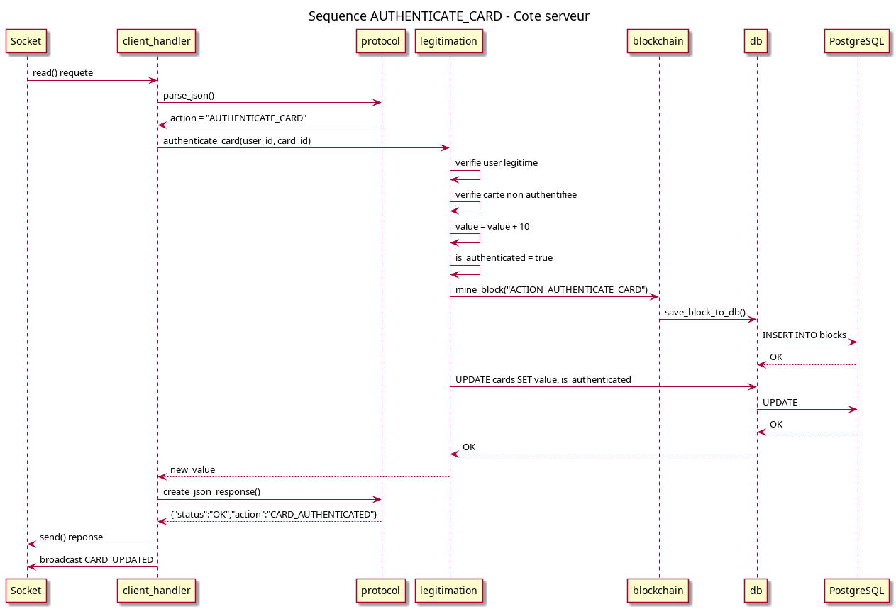

## 9. Déconnexion

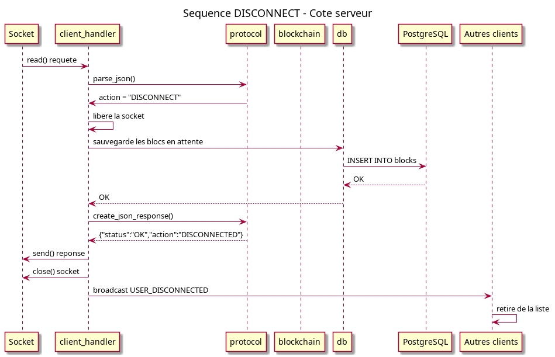

## 10. Minage

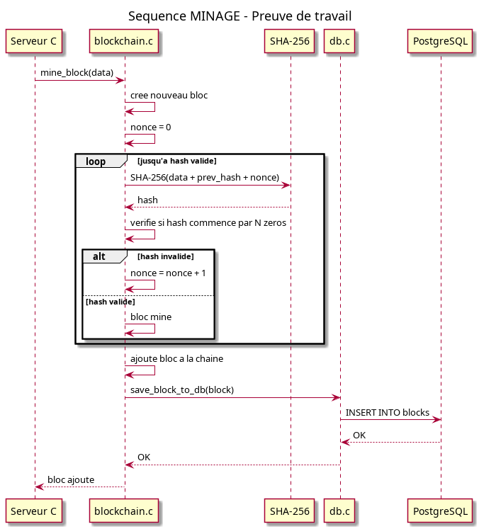

## 11. Vérification

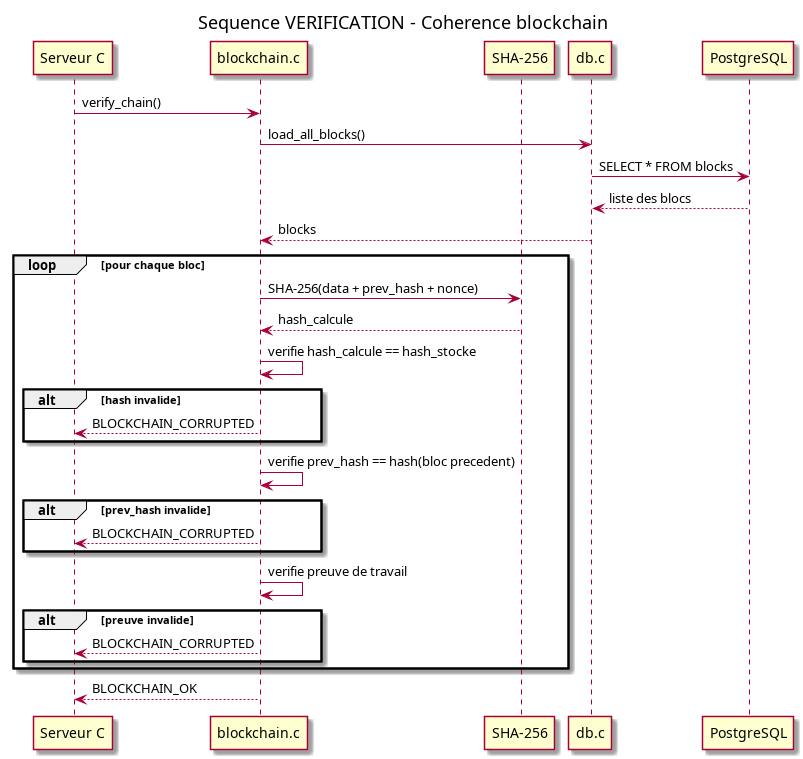
